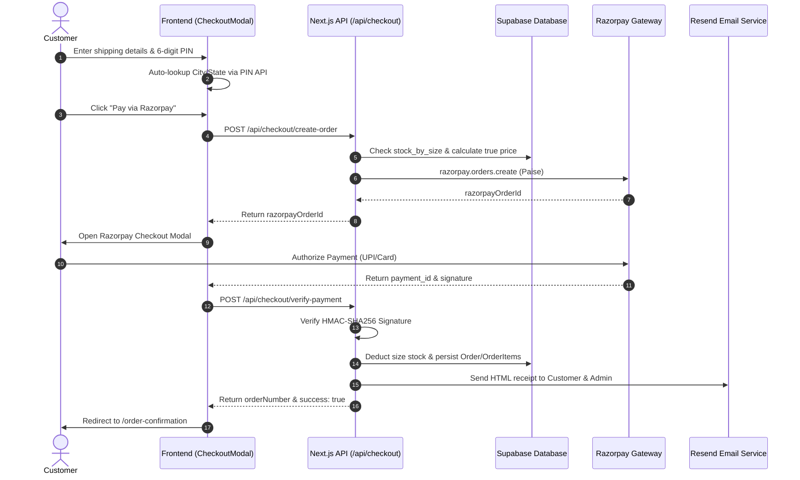

# ZYRO Wear — Complete Project Architecture & Codebase Documentation

> **Official Technical Specification & System Architecture**  
> **Repository:** `Aswinram2309/Zyro-wear`  
> **Framework:** Next.js 14.2.35 (App Router, React 18.3.1, TypeScript 5.4.5)  
> **Generated:** March 2026

---

## Table of Contents

1. [Project Overview](#1-project-overview)
2. [Complete Folder Structure](#2-complete-folder-structure)
3. [Landing Page Architecture](#3-landing-page-architecture)
4. [Routing](#4-routing)
5. [Product Architecture](#5-product-architecture)
6. [Product Image Architecture](#6-product-image-architecture)
7. [Supabase Architecture](#7-supabase-architecture)
8. [Admin Dashboard](#8-admin-dashboard)
9. [Cart Architecture](#9-cart-architecture)
10. [Checkout Architecture](#10-checkout-architecture)
11. [PIN Code API](#11-pin-code-api)
12. [Razorpay Payment Architecture](#12-razorpay-payment-architecture)
13. [API Endpoint Documentation](#13-api-endpoint-documentation)
14. [Resend Email Architecture](#14-resend-email-architecture)
15. [Reviews / Customer Feedback](#15-reviews--customer-feedback)
16. [Site Announcement / Offer Banner](#16-site-announcement--offer-banner)
17. [Order Architecture](#17-order-architecture)
18. [Security Architecture](#18-security-architecture)
19. [Stock Management & Concurrency](#19-stock-management--concurrency)
20. [Environment Variables](#20-environment-variables)
21. [External Services](#21-external-services)
22. [Complete Data Flow (Mermaid Diagrams)](#22-complete-data-flow)
23. [File-to-Feature Mapping](#23-file-to-feature-mapping)
24. [Potential Technical Debt & Recommendations](#24-potential-technical-debt)

---

# 1. Project Overview

### What ZYRO Wear Is
**ZYRO Wear** (`zyrowear.in`) is an ultra-fast, mobile-first e-commerce platform specializing in premium official international football kits, club jerseys, and athletic streetwear. Designed with a high-conversion dark athletic aesthetic, dynamic glassmorphic interactions, instant PIN code geolocation, Razorpay direct checkout, customer photo reviews, and real-time size-level inventory control.

### What the Website Does
- **Browse & Search:** High-performance catalog filterable by International Star Kits vs. Club Kits, real-time live search overlay with debounced indexing.
- **Product Presentation:** Dual-view front/back jersey switching, dynamic size selection (`M`, `L`, `XL`, `XXL`), interactive modal quick-views, and dedicated SEO-optimized standalone product pages (`/product/[slug]`).
- **Interactive Sizing:** Real-time size measurement guides & conversion charts modal.
- **Direct Cart & Slide-out Drawer:** Client-side synchronized cart drawer with persistent `localStorage` support, auto-calculating free shipping thresholds (threshold: ₹999).
- **Automated Delivery Lookup:** 6-digit Indian postal code auto-detection via `api.postalpincode.in` instantly filling City and State.
- **Frictionless Payment:** Razorpay Checkout gateway integration with HMAC-SHA256 signature verification and atomic rollback protection.
- **Automated Communication:** Resend API server-side transactional dispatching HTML confirmation receipts to customers and alert emails to store admins.
- **Social Proof & UGC:** Customer photo review uploads stored in Supabase Storage with image modal lightbox preview and dynamic star rating metrics.
- **Administrative Backoffice:** PIN/password protected administrative portal (`/admin/dashboard`, `/admin/stock`, `/admin/login`) for inventory adjustment, product creation/editing, multi-file uploads, banner announcements, and order tracking.

### Main Customer Flow
```
Homepage / Catalog
  ↓ Select Size (M/L/XL/XXL) & Add to Cart
Cart Drawer / Direct Buy Now
  ↓ Open Checkout Modal
Delivery Form (Name, Phone, Address, PIN Code auto-fill)
  ↓ Server Pre-validation & Razorpay Order Creation
Razorpay Payment Modal (UPI / Card / NetBanking)
  ↓ Client Signature Handshake
Server-Side HMAC-SHA256 Verification & Stock Deduction
  ↓ Resend Order Confirmation Email (Customer + Admin)
Order Confirmation Page (/order-confirmation?orderNumber=...)
```

### Main Admin Flow
```
Admin Portal Access (/admin/login)
  ↓ Session Authentication via Secure Passcode
Admin Dashboard (/admin/dashboard)
  ├── Live Order Fulfillment & Status Management
  ├── Product Creation & Edit Suite (Supabase Storage upload)
  └── Dynamic Announcement Bar Management
Stock Management Suite (/admin/stock)
  └── Size-level real-time inventory increment/decrement
```

### Overall Technology Stack
- **Core Framework:** Next.js 14.2.35 (React 18.3.1, TypeScript 5.4.5, App Router).
- **Styling & Design System:** Tailwind CSS v3.4.1 + PostCSS + Lucide Icons + Google Outfit/Inter typography.
- **Database & Object Storage:** Supabase (PostgreSQL 15 + Supabase Storage Buckets `products` and `review-images`).
- **Payment Processing:** Razorpay Node.js SDK + Razorpay Checkout JS modal.
- **Transactional Email Service:** Resend API (`resend` SDK v4.0.0).
- **Geolocation Service:** Postal PIN Code API (`https://api.postalpincode.in`).
- **Hosting / Deployment Target:** Vercel (Edge network + Node.js Serverless runtime).

---

# 2. Complete Folder Structure

Below is the verified directory layout of the ZYRO Wear codebase:

```
zyro-wear/
├── .env.example                       # Template for environment configuration
├── .env.local                         # Local environment variables (gitignored)
├── next.config.mjs                    # Next.js compiler & remote image security config
├── package.json                       # Dependency tree and npm script definitions
├── tsconfig.json                      # TypeScript strict compiler options & path aliases
├── public/                            # Static assets directly served by Next.js
│   ├── ZYRO_Wear_Studio_Imgs/         # High-resolution jersey studio photography
│   ├── logo/                          # ZYRO Wear vector badges and iconography
│   └── videos/                        # Promotional videos (e.g. hero-bg.mp4)
├── app/                               # Next.js App Router root
│   ├── admin/                         # Admin portal routes
│   │   ├── dashboard/page.tsx         # Orders & product catalog management dashboard
│   │   ├── login/page.tsx             # Admin authentication gateway
│   │   └── stock/page.tsx             # Size-specific inventory control interface
│   ├── api/                           # Server-side API endpoints
│   │   ├── admin/                     # Protected backoffice operations
│   │   │   ├── orders/                # Fetch & update order status
│   │   │   ├── products/              # Create, edit, delete store products
│   │   │   ├── settings/              # Read/write site announcement bar
│   │   │   └── upload/                # Admin product image upload pipeline
│   │   ├── checkout/                  # Customer checkout flows
│   │   │   ├── create-order/          # Server validation & Razorpay order generation
│   │   │   └── verify-payment/        # Signature check, DB persist, stock deduction, email
│   │   ├── create-order/              # Standalone order creation endpoint
│   │   ├── products/                  # Public catalog GET endpoint
│   │   ├── reviews/                   # UGC review submission & fetching
│   │   │   └── upload/                # UGC customer photo upload to Supabase Storage
│   │   ├── settings/                  # Public site settings & announcement endpoint
│   │   └── verify-payment/            # Standalone payment verification endpoint
│   ├── order-confirmation/page.tsx    # Customer order success receipt view
│   ├── product/[slug]/page.tsx        # Dynamic individual product details page
│   ├── layout.tsx                     # Global HTML shell, fonts, metadata
│   ├── page.tsx                       # Root landing page entry point
│   ├── loading.tsx                    # Route loading skeleton
│   ├── not-found.tsx                  # Custom 404 page
│   ├── error.tsx                      # Route error boundary
│   ├── global-error.tsx               # Root application error boundary
│   ├── robots.ts                      # Dynamic SEO robots.txt generator
│   └── sitemap.ts                     # Dynamic XML sitemap generator
├── backend/                           # Server-side domain business logic
│   └── services/
│       └── email-service.ts           # Resend email templates & dispatch logic
├── database/                          # Persistence layer, stores, migrations
│   ├── client/
│   │   ├── admin.ts                   # Supabase service-role client (elevated permissions)
│   │   ├── client.ts                  # Supabase public client (anon key)
│   │   └── server.ts                  # Supabase server-side client
│   ├── migrations/
│   │   └── schema.sql                 # PostgreSQL DDL tables, RLS policies, seed scripts
│   ├── seed/
│   │   └── products-data.ts           # 10 core football jersey initial catalog data
│   └── stores/
│       ├── orders-store.ts            # Order data access object (Supabase + fallback)
│       ├── products-store.ts          # Product data access object (Supabase + fallback)
│       └── settings-store.ts          # Settings DAO (Supabase + fallback)
├── data/                              # Local JSON persistence fallbacks
│   ├── orders.json                    # Local storage backup for orders
│   ├── products.json                  # Local storage backup for catalog
│   └── site_settings.json             # Local storage backup for announcement banner
├── frontend/                          # Client-side UI & presentation layer
│   ├── components/
│   │   ├── CartDrawer.tsx             # Slide-over cart panel with quantity selectors
│   │   ├── CheckoutModal.tsx          # Multi-step checkout modal with PIN code auto-fill
│   │   ├── Footer.tsx                 # Brand footer with links, policies, contact info
│   │   ├── Hero.tsx                   # Full-width cinematic video hero component
│   │   ├── MainStore.tsx              # Catalog container, filtering, search, and product grid
│   │   ├── Navbar.tsx                 # Global sticky nav, announcement ticker, search, cart
│   │   ├── OfflineStatus.tsx          # Offline connectivity detector & toast
│   │   ├── ProductCard.tsx            # Responsive 2-column catalog card with quick buy
│   │   ├── ProductDetailsClient.tsx   # Detailed product view (carousel, zoom, reviews)
│   │   ├── ProductModal.tsx           # Quick-view product overlay modal
│   │   ├── ReviewsSection.tsx         # Customer review carousel with star filters
│   │   └── SizeChart.tsx              # Interactive modal size measurement guide
│   └── styles/                        # Global style declarations
├── lib/
│   └── razorpay.ts                    # Razorpay instance initializer & HMAC verification
└── shared/
    ├── constants/
    │   ├── contact-config.ts          # Store contact details (WhatsApp, phone, email)
    │   └── stock-config.ts            # Stock threshold configurations & default sizes
    └── types/
        └── index.ts                   # Unified TypeScript interfaces & domain types
```

### Folder Responsibilities
- **`app/`**: Next.js 14 App Router handling all routing, server-rendered layouts, dynamic slug pages, and HTTP API route handlers.
- **`backend/services/`**: Isolated server-side services (email dispatch, external integrations) keeping business logic separated from HTTP controllers.
- **`database/`**: Single point of contact for data persistence. Contains Supabase clients, SQL schemas, seed fixtures, and Data Access Stores (`products-store.ts`, `orders-store.ts`, `settings-store.ts`) that manage database queries with transparent failover to local JSON files if the database connection is interrupted.
- **`frontend/components/`**: Modular, reusable React client components adhering to high visual standards, micro-animations, and responsive design.
- **`lib/`**: Centralized third-party SDK client wrappers (Razorpay).
- **`shared/`**: Common types, domain models, and business constants shared across frontend, backend, and database layers.

---

# 3. Landing Page Architecture

### Entry Point & Component Hierarchy
- **Main Entry Route:** `app/page.tsx`
- **Main Client Component:** `frontend/components/MainStore.tsx`

### Component Relationship Tree
```
app/page.tsx
 └── MainStore (Client Component)
      ├── Navbar (Sticky Navigation & Announcement Banner)
      ├── Hero (Full-Width Cinematic Video Hero)
      ├── Catalog Section
      │    ├── Search Bar & Filter Tabs (All / Star Kits / Club Kits)
      │    └── Product Grid (2 Columns on Mobile, 3-4 on Desktop)
      │         └── ProductCard (Multiple Instances)
      ├── ProductModal (Quick-View Pop-up triggered from Card)
      ├── SizeChart (Measurement Guide Modal)
      ├── About Section ("ABOUT ZYRO WEAR - WEAR YOUR PASSION")
      ├── ReviewsSection (Customer Feedback Showcase)
      ├── CartDrawer (Slide-out Cart Panel)
      ├── CheckoutModal (Payment & Shipping Form)
      ├── OfflineStatus (Network State Monitor)
      └── Footer (Brand Links & Support)
```

### Section Locations in Codebase
| Section | Component File | Code Location |
|---|---|---|
| **Header & Announcement** | `frontend/components/Navbar.tsx` | Sticky nav at top of layout |
| **Hero Video** | `frontend/components/Hero.tsx` | Full-width autoplaying, looping inline video |
| **Product Showcase & Grid** | `frontend/components/MainStore.tsx` + `ProductCard.tsx` | Middle catalog grid |
| **About Brand Section** | `frontend/components/MainStore.tsx` | Below catalog (`#about` anchor) |
| **Reviews & Feedback** | `frontend/components/ReviewsSection.tsx` | Bottom section before footer (`#reviews` anchor) |
| **Footer** | `frontend/components/Footer.tsx` | Page bottom |

---

# 4. Routing

Every route currently active in the ZYRO Wear application:

| URL Path | Responsible File | Purpose | Dynamic Params | Auth Required |
|---|---|---|---|---|
| `/` | `app/page.tsx` | Main e-commerce landing page & catalog | None | Public |
| `/product/[slug]` | `app/product/[slug]/page.tsx` | Dedicated standalone product page | `slug` (e.g., `argentina-home-kit-messi-10`) | Public |
| `/order-confirmation` | `app/order-confirmation/page.tsx` | Post-checkout customer order receipt | Query params (`orderNumber`, `order_id`) | Public |
| `/admin/login` | `app/admin/login/page.tsx` | Secure backoffice authentication screen | None | Public (Gateway) |
| `/admin/dashboard` | `app/admin/dashboard/page.tsx` | Admin control center for orders & products | None | **Admin Only** (PIN Session) |
| `/admin/stock` | `app/admin/stock/page.tsx` | Dedicated inventory & size stock management | None | **Admin Only** (PIN Session) |
| `/robots.ts` | `app/robots.ts` | Dynamic search engine indexing rules | None | Public |
| `/sitemap.ts` | `app/sitemap.ts` | Dynamic XML sitemap for SEO | None | Public |
| `/not-found.tsx` | `app/not-found.tsx` | Custom branded 404 page | None | Public |
| `/error.tsx` | `app/error.tsx` | Interactive error recovery UI | None | Public |

---

# 5. Product Architecture

### Product Schema & Data Fields
Products are stored in Supabase under the `public.products` table with the following structure:
- **`id` (TEXT PRIMARY KEY):** Stable unique identifier (e.g., `'arg-home-10'`).
- **`name` (TEXT):** Product title (e.g., `'Argentina Home Kit (Messi #10)'`).
- **`slug` (TEXT UNIQUE):** SEO-friendly URL slug (e.g., `'argentina-home-kit-messi-10'`).
- **`description` (TEXT):** Full product specifications and description.
- **`price` (NUMERIC):** Current retail price in INR (e.g., `299`).
- **`mrp` (NUMERIC):** Maximum Retail Price for discount display (e.g., `699`).
- **`sale_price` (NUMERIC, Optional):** Promotional price if active.
- **`category` (TEXT):** Category classification (`'star'`, `'club'`, `'international'`).
- **`nation` (TEXT, Optional):** Associated country or team (e.g., `'Argentina'`, `'Spain'`).
- **`front_img` (TEXT):** Front jersey image relative path or public HTTPS URL.
- **`back_img` (TEXT):** Back jersey image relative path or public HTTPS URL.
- **`images` (TEXT[]):** Array of gallery images.
- **`sizes` (TEXT[]):** Available sizes (Standard: `['M', 'L', 'XL', 'XXL']` — `S` is excluded).
- **`stock` (INTEGER):** Total aggregated stock across all sizes.
- **`stock_by_size` (JSONB):** Size-level inventory mapping (e.g., `{"M": 15, "L": 15, "XL": 10, "XXL": 5}`).
- **`is_active` (BOOLEAN):** Soft-deletion/visibility toggle (`true`/`false`).
- **`created_at` / `updated_at` (TIMESTAMPTZ):** Audit timestamps.

### How Product Updates Reach the Store
```
Admin Dashboard Edit / Create
  ↓ POST/PUT /api/admin/products
Database Store (products-store.ts)
  ↓ Upserts to Supabase 'products' table
Frontend Polling / Navigation
  ↓ GET /api/products?t={timestamp} (cache: 'no-store')
React State Updated in MainStore / ProductDetailsClient
```

### Data Sources & Single Source of Truth
1. **Primary Single Source of Truth:** Supabase PostgreSQL `products` table.
2. **Local Fallback:** `data/products.json` (used transparently by `database/stores/products-store.ts` if Supabase network requests encounter downtime).
3. **Database Seed Source:** `database/seed/products-data.ts` (10 official international football kits used for initial DB initialization).

---

# 6. Product Image Architecture

### Image Ingestion & Storage Pipeline
```
Admin Dashboard Upload Form
  ↓
POST /api/admin/upload (Multipart FormData: file, type, productId)
  ↓
Validation (MIME type check: image/*, Size check: Max 10MB)
  ↓
Upload to Supabase Storage: bucket 'products' at path 'product/{productId}/{filename}'
  ↓
Generate Public URL via Supabase Storage: https://[project-id].supabase.co/storage/v1/object/public/products/...
  ↓
Store URL in 'front_img', 'back_img', or 'images' column of 'products' table
  ↓
ProductCard / ProductDetailsClient render with Next.js <Image /> or 
```

### Storage Bucket Specifications
| Bucket Name | Intended Assets | Privacy | Max Size | Allowed MIME Types |
|---|---|---|---|---|
| `products` | Product front/back studio photos | Public | 10 MB | JPEG, PNG, WebP |
| `review-images` | Customer review UGC photos | Public | 10 MB | JPEG, PNG, HEIC |

---

# 7. Supabase Architecture

### Database Tables Specification

#### 1. Table: `public.products`
- **Purpose:** Primary catalog of all jerseys and merchandise.
- **Important Columns:** `id` (PK), `name`, `slug` (Unique), `price`, `mrp`, `sale_price`, `category`, `nation`, `front_img`, `back_img`, `images`, `sizes`, `stock`, `stock_by_size`, `is_active`, `created_at`, `updated_at`.
- **Used By:** `MainStore`, `ProductCard`, `ProductDetailsClient`, `/api/products`, `/api/checkout/create-order`, `/api/admin/products`.

#### 2. Table: `public.orders`
- **Purpose:** Central record of customer orders and payment statuses.
- **Important Columns:** `id` (UUID PK), `order_number` (Unique), `customer_name`, `phone`, `email`, `address`, `city`, `state`, `pincode`, `subtotal`, `total_amount`, `payment_status` (`PAID`, `PENDING`, `FAILED`), `order_status` (`NEW`, `CONFIRMED`, `PROCESSING`, `SHIPPED`, `DELIVERED`), `razorpay_order_id`, `razorpay_payment_id`, `created_at`, `updated_at`.
- **Used By:** `/api/checkout/verify-payment`, `/api/admin/orders`, `app/admin/dashboard`.

#### 3. Table: `public.order_items`
- **Purpose:** Individual line items associated with an order.
- **Important Columns:** `id` (UUID PK), `order_id` (FK → `orders.id` ON DELETE CASCADE), `product_id` (TEXT), `product_name` (TEXT), `size` (TEXT), `quantity` (INTEGER), `price` (NUMERIC), `created_at`.
- **Used By:** `/api/checkout/verify-payment`, `/api/admin/orders`.

#### 4. Table: `public.reviews`
- **Purpose:** Customer feedback, star ratings, and UGC photos.
- **Important Columns:** `id` (UUID PK), `product_id` (TEXT), `rating` (INTEGER 1-5), `customer_name` (TEXT), `comment` (TEXT), `image_url` (TEXT, optional), `is_verified` (BOOLEAN), `created_at`.
- **Used By:** `ReviewsSection`, `ProductDetailsClient`, `/api/reviews`.

#### 5. Table: `public.site_settings`
- **Purpose:** Global administrative announcements and ticker toggles.
- **Important Columns:** `id` (TEXT PK, e.g. `'global_settings'`), `announcement_message` (TEXT), `announcement_enabled` (BOOLEAN), `updated_at`.
- **Used By:** `Navbar`, `/api/settings`, `/api/admin/settings`.

#### 6. Table: `public.categories`
- **Purpose:** Product classification taxonomy.
- **Important Columns:** `id` (UUID PK), `name` (TEXT), `slug` (TEXT UNIQUE), `created_at`.

### Row Level Security (RLS) Policies
- `categories`: Public read enabled (`SELECT USING (true)`).
- `products`: Public read enabled for active items (`SELECT USING (is_active = true)`).
- `orders` & `order_items`: Public insert enabled for guest checkout, service-role admin full access.
- `reviews`: Public read and authenticated/guest insert enabled.

---

# 8. Admin Dashboard

### Routes & Feature Matrix
- **`/admin/login` (`app/admin/login/page.tsx`):**
  - Session authorization using `ADMIN_PASSWORD` (stored in `.env.local`).
  - Sets browser session token `sessionStorage.setItem('zyro_admin_auth', 'true')`.
- **`/admin/dashboard` (`app/admin/dashboard/page.tsx`):**
  - **Live Orders:** View incoming orders, customer details, address, payment IDs, and update fulfillment status (`NEW` → `CONFIRMED` → `SHIPPED` → `DELIVERED`).
  - **Product Suite:** Add new kits, edit pricing, change categories, update front/back imagery via Supabase storage, toggle active visibility, delete products.
  - **Announcement Bar:** Live update the announcement ticker text and toggle visibility across the storefront.
- **`/admin/stock` (`app/admin/stock/page.tsx`):**
  - Granular real-time stock control for sizes `M`, `L`, `XL`, and `XXL`.
  - Batch stock increments/decrements and out-of-stock emergency toggles.

---

# 9. Cart Architecture

### State & Flow Architecture
```
ProductCard / ProductDetails ("ADD TO CART" / "BUY NOW")
  ↓
Validate Size Selection (M / L / XL / XXL)
  ↓
cartState in MainStore / CartContext
  ↓
Synchronize with browser localStorage ('zyro_cart_v1')
  ↓
CartDrawer displays item list, subtotal, and shipping fee calculation
  ↓
Free Delivery threshold check: Subtotal >= ₹999 ? Free : ₹49
  ↓
Click "CHECKOUT" → Open CheckoutModal
```

### Cart Item Object Model
```typescript
interface CartItem {
  productId: string;
  name: string;
  price: number;
  size: 'M' | 'L' | 'XL' | 'XXL';
  quantity: number;
  image: string;
}
```

---

# 10. Checkout Architecture

### End-to-End Checkout Pipeline
```
Customer in CheckoutModal
  ↓ Enters Full Name, 10-digit Phone, Full Street Address
Customer Enters 6-digit Indian PIN Code
  ↓ Automatic Geolocation Lookup (api.postalpincode.in)
City & State Populated Automatically
  ↓ Customer clicks "PAY ₹[TOTAL] VIA RAZORPAY"
Frontend sends items & customer payload to POST /api/checkout/create-order
  ↓ Server checks real-time database stock & validates prices
Server calls Razorpay SDK (razorpay.orders.create) in paise
  ↓ Returns razorpayOrderId to frontend
Frontend initializes Razorpay Checkout JS modal
  ↓ Customer completes payment (UPI, Cards, NetBanking, Wallets)
Razorpay returns payment_id, order_id, and signature
  ↓ Frontend sends signature bundle to POST /api/checkout/verify-payment
Server verifies HMAC-SHA256 signature using RAZORPAY_KEY_SECRET
  ↓ Server idempotency check prevents duplicate order creation
Server atomically deducts size-wise stock in database
  ↓ Server persists order in 'orders' & 'order_items' tables
Server triggers Resend API to email customer receipt + admin notification
  ↓ Client receives orderNumber and redirects to /order-confirmation?orderNumber=...
```

---

# 11. PIN Code API

### Implementation Details
- **Trigger Condition:** User inputs exactly 6 digits into the PIN code field in `CheckoutModal.tsx`.
- **External Endpoint:** `GET https://api.postalpincode.in/pincode/{PINCODE}`
- **HTTP Method:** `GET`
- **Handling & Auto-Population:**
  - Extracts `PostOffice[0].District` → Populates **City**.
  - Extracts `PostOffice[0].State` → Populates **State**.
- **User Feedback & Errors:**
  - While loading: Displays `"Fetching location..."` with a spinner.
  - On invalid PIN: Displays `"Invalid PIN code. Please check and try again."` and clears state/city fields.
  - On user change/backspace: Resets previously populated city/state fields.
  - User can manually edit or refine city/state if desired.

---

# 12. Razorpay Payment Architecture

### Payment Processing Flow
- **Frontend Integration File:** `frontend/components/CheckoutModal.tsx`
- **Backend SDK Client:** `lib/razorpay.ts`
- **Order Creation Endpoint:** `POST /api/checkout/create-order`
- **Payment Verification Endpoint:** `POST /api/checkout/verify-payment`

### Signature Verification Logic
```typescript
import crypto from 'crypto';

export function verifyRazorpaySignature(
  orderId: string,
  paymentId: string,
  signature: string
): boolean {
  const secret = process.env.RAZORPAY_KEY_SECRET;
  if (!secret) throw new Error('RAZORPAY_KEY_SECRET is not configured');

  const generatedSignature = crypto
    .createHmac('sha256', secret)
    .update(`${orderId}|${paymentId}`)
    .digest('hex');

  return generatedSignature === signature;
}
```

### Amount Conversion & Currency
- Frontend inputs currency in INR (₹).
- Backend converts to **Paise** (`amountInPaise = Math.round(totalAmount * 100)`).
- Minimum transaction allowed: 100 paise (₹1.00).

---

# 13. API Endpoint Documentation

| Method | Endpoint | File Location | Purpose | Auth | External Service | Database Access |
|---|---|---|---|---|---|---|
| `GET` | `/api/products` | `app/api/products/route.ts` | Retrieve active product catalog | Public | None | `products` table |
| `POST` | `/api/checkout/create-order` | `app/api/checkout/create-order/route.ts` | Server price check & Razorpay order creation | Public | Razorpay API | `products` table |
| `POST` | `/api/checkout/verify-payment` | `app/api/checkout/verify-payment/route.ts` | Verify signature, deduct stock, persist order, email | Public | Razorpay, Resend | `orders`, `order_items`, `products` |
| `GET` | `/api/reviews` | `app/api/reviews/route.ts` | Fetch reviews for a product or all | Public | None | `reviews` table |
| `POST` | `/api/reviews` | `app/api/reviews/route.ts` | Submit customer review & rating | Public | None | `reviews` table |
| `POST` | `/api/reviews/upload` | `app/api/reviews/upload/route.ts` | Upload review photo | Public | Supabase Storage | `review-images` bucket |
| `GET` | `/api/settings` | `app/api/settings/route.ts` | Fetch announcement ticker message | Public | None | `site_settings` table |
| `GET` | `/api/admin/orders` | `app/api/admin/orders/route.ts` | List all orders with line items | Admin | None | `orders`, `order_items` |
| `PATCH` | `/api/admin/orders/[id]` | `app/api/admin/orders/[id]/route.ts` | Update order status | Admin | None | `orders` table |
| `POST` | `/api/admin/products` | `app/api/admin/products/route.ts` | Create new product | Admin | None | `products` table |
| `PUT` | `/api/admin/products/[id]` | `app/api/admin/products/[id]/route.ts` | Update existing product | Admin | None | `products` table |
| `DELETE` | `/api/admin/products/[id]` | `app/api/admin/products/[id]/route.ts` | Soft-delete product | Admin | None | `products` table |
| `POST` | `/api/admin/upload` | `app/api/admin/upload/route.ts` | Admin product image upload | Admin | Supabase Storage | `products` bucket |
| `POST` | `/api/admin/settings` | `app/api/admin/settings/route.ts` | Update announcement ticker | Admin | None | `site_settings` table |

---

# 14. Resend Email Architecture

### Email Processing Details
- **Implementation File:** `backend/services/email-service.ts`
- **SDK:** `resend` (`Resend` client initialized with `RESEND_API_KEY`).
- **Sender Address:** `ZYRO WEAR <orders@zyrowear.in>` (fallback: `onboarding@resend.dev` in development mode).
- **Recipients:**
  1. **Customer:** Receives a dark-mode styled HTML receipt with order number, itemized table, total, and delivery address.
  2. **Store Admin:** Receives an alert notification with payment ID and customer contact information.
- **Error Handling:** Email errors are caught and logged without interrupting the user's successful checkout response.

---

# 15. Reviews / Customer Feedback

### UGC Flow
```
Customer on Product Detail Page (/product/[slug])
  ↓ Fills rating (1-5 stars), name, comment
Customer attaches photo (optional)
  ↓ Uploads via POST /api/reviews/upload to Supabase Storage ('review-images')
Photo public URL returned
  ↓ POST /api/reviews with product_id, rating, comment, image_url
Review stored in Supabase 'reviews' table
  ↓ Reviews displayed in ReviewsSection & ProductDetailsClient with photo lightbox
```

---

# 16. Site Announcement / Offer Banner

- **Admin Management:** Controlled via `/admin/dashboard` under the Announcement tab.
- **Database Table:** `public.site_settings` (row ID: `'global_settings'`).
- **Public Fetching:** `Navbar.tsx` queries `/api/settings` on mount to render top marquee banner.
- **Toggle Support:** Displays only when `announcement_enabled: true`.

---

# 17. Order Architecture

### Order Lifecycle States
- **`payment_status`:** `PAID` | `PENDING` | `FAILED`
- **`order_status`:** `NEW` → `CONFIRMED` → `PROCESSING` → `SHIPPED` → `DELIVERED`
- **Identifiers:**
  - `order_number`: Branded human-readable ID (e.g. `ZY8492`).
  - `razorpay_order_id`: Razorpay reference (e.g. `order_P7aB...`).
  - `razorpay_payment_id`: Razorpay transaction ID (e.g. `pay_P7aC...`).

---

# 18. Security Architecture

### Security Controls & Best Practices
1. **Server-Side Price Validation:** Product prices are calculated strictly on the server from the authoritative database records, preventing client-side price tampering.
2. **Cryptographic Payment Verification:** Razorpay payment verification uses HMAC-SHA256 signature verification with `RAZORPAY_KEY_SECRET` exclusively on the server.
3. **Idempotency Safeguard:** Verification endpoint verifies whether a `razorpay_payment_id` has already been recorded before processing to prevent replay attacks.
4. **Secret Isolation:** API keys (`RAZORPAY_KEY_SECRET`, `SUPABASE_SERVICE_ROLE_KEY`, `RESEND_API_KEY`) are kept on the server and never prefixed with `NEXT_PUBLIC_`.
5. **SQL Injection Protection:** Queries execute through Supabase parameterized query builders.
6. **Input Sanitization:** Upload endpoints enforce strict MIME type whitelists (`image/jpeg`, `image/png`, `image/webp`) and 10MB payload size limits.

---

# 19. Stock Management & Concurrency

### Current Stock Workflow
- **Data Source:** `stock_by_size` JSONB column in `public.products` (sizes `M`, `L`, `XL`, `XXL`).
- **Validation:** Checked at cart creation, modal checkout initiation, and verified again prior to Razorpay order creation.
- **Deduction:** Executed upon payment confirmation in `deductSizeStock()`. If any item fails, previous deductions in that transaction are restored via `restoreSizeStock()`.

> [!WARNING]
> **⚠️ CONCURRENCY RATING: NEEDS IMPROVEMENT**  
> While transactional rollback logic is implemented in application code, high-concurrency flash sales could experience race conditions without database-level atomic row locks (`SELECT FOR UPDATE`) or a dedicated PostgreSQL stored procedure (RPC). Recommended upgrade: migrate `deductSizeStock` to a Supabase Postgres Function.

---

# 20. Environment Variables

| Variable Name | Purpose / Scope | Client or Server |
|---|---|---|
| `NEXT_PUBLIC_SUPABASE_URL` | Supabase project API gateway | Public (Client & Server) |
| `NEXT_PUBLIC_SUPABASE_ANON_KEY` | Supabase public anonymous key | Public (Client & Server) |
| `SUPABASE_SERVICE_ROLE_KEY` | Supabase administrative service role | **Server Only** |
| `NEXT_PUBLIC_RAZORPAY_KEY_ID` | Razorpay checkout client identifier | Public (Client & Server) |
| `RAZORPAY_KEY_ID` | Razorpay server API key ID | **Server Only** |
| `RAZORPAY_KEY_SECRET` | Razorpay HMAC signature secret | **Server Only** |
| `RESEND_API_KEY` | Resend transactional email API key | **Server Only** |
| `ADMIN_PASSWORD` | Backoffice authentication passkey | **Server Only** |
| `NEXT_PUBLIC_SITE_URL` | Canonical URL for SEO sitemaps | Public (Client & Server) |

---

# 21. External Services

| Service | Purpose | Integration Point |
|---|---|---|
| **Supabase** | PostgreSQL Database & File Storage | `database/client/`, `database/stores/` |
| **Razorpay** | Payment Gateway & Checkout | `lib/razorpay.ts`, `CheckoutModal.tsx` |
| **Resend** | Transactional Email Notifications | `backend/services/email-service.ts` |
| **Postal PIN Code API** | Indian Postal PIN Geolocation | `frontend/components/CheckoutModal.tsx` |

---

# 22. Complete Data Flow

### Customer Checkout & Payment Flow


---

# 23. File-to-Feature Mapping

| Feature | Main Component / Page | Supporting Files | Database / API Routes |
|---|---|---|---|
| **Hero Section** | `frontend/components/Hero.tsx` | `public/videos/hero-bg.mp4` | Static video asset |
| **Product Catalog** | `frontend/components/MainStore.tsx` | `ProductCard.tsx`, `ProductModal.tsx` | `GET /api/products`, `products` table |
| **Product Details** | `app/product/[slug]/page.tsx` | `ProductDetailsClient.tsx`, `SizeChart.tsx` | `GET /api/products`, `products` table |
| **Cart Drawer** | `frontend/components/CartDrawer.tsx` | `localStorage` sync | Client-side state |
| **Checkout & PIN Code** | `frontend/components/CheckoutModal.tsx` | `https://api.postalpincode.in` | `POST /api/checkout/create-order` |
| **Razorpay Verification** | `app/api/checkout/verify-payment/route.ts` | `lib/razorpay.ts` | `orders`, `order_items` tables |
| **Email Receipt** | `backend/services/email-service.ts` | Resend SDK | External Resend API |
| **Customer Reviews** | `frontend/components/ReviewsSection.tsx` | `app/api/reviews/upload/route.ts` | `reviews` table, `review-images` bucket |
| **Admin Dashboard** | `app/admin/dashboard/page.tsx` | `app/admin/stock/page.tsx` | `/api/admin/*`, Supabase Admin client |

---

# 24. Potential Technical Debt

1. **Duplicate Endpoint Aliases:** `/api/create-order` and `/api/checkout/create-order` share overlapping logic. Retained to preserve backward compatibility with legacy webhooks/clients.
2. **Concurrency Stock Deductions:** Application-level stock deduction should eventually be transitioned to a PostgreSQL RPC stored procedure with row-locking for high-volume flash sales.
3. **Admin Authentication:** Current admin authentication uses a shared session token; for multi-user enterprise access, Supabase Auth with RBAC (Role-Based Access Control) can be adopted in future milestones.
